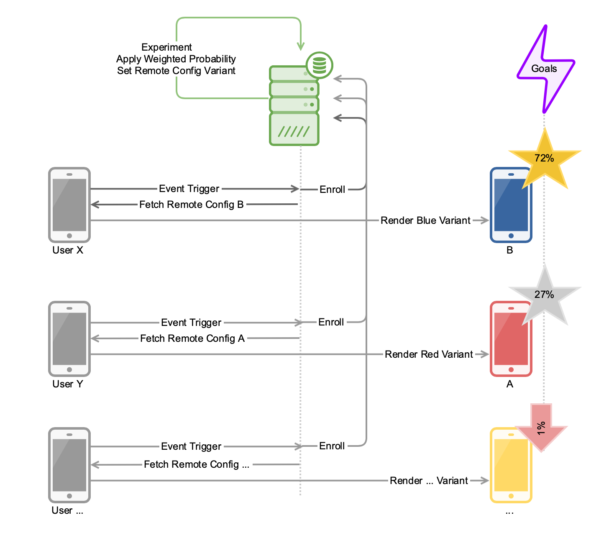

# B-and-A

An open, real-time, scalable and redis based A/B Testing Backend Service.

With flexible and very generic APIs it takes advantage of recent Redis Stack Graph, TimeSeries and JSON to provide a simple although functional alternative for massive scalable A/B testing services including weighted experiments, remote config, events, triggers, etc...

* Experiments API - Scalable A/B Testing Experiments Service (supports weights and trigger based enroll)
* Remote Config API - Scalable Remote Client Configuration Service with A/B Support (similar to Firebase)
* Events API - Scalable User Events Backend Service (integrated with A/B Experiments)
* Callback Schedule API - Flexible HTTP Request Scheduler
* Summary API - Allow Incremental Computation of Scores/Summaries 
* Drawer API - Generic Key/Value Property Service 

Future Steps:
* Machine Learning Based Experiment Result Analysis using RedisAI



## Docker Run Command

```
docker run -p 8080:8080 -e BASE_URL -e PORT -e REDIS_URL com.xmppjingle/bjomeliga-docker-boot -ti
```

## Complete API Documentation
Swagger available at: http://localhost:8080/swagger-ui/#/

## Setting Up Redis Modules

```shell
docker run \
  -p 6379:6379 \
  -v /home/user/redis_data:/data \
  -it \
  redislabs/redismod \
  --loadmodule /usr/lib/redis/modules/rejson.so \
  --loadmodule /usr/lib/redis/modules/redistimeseries.so \
  --loadmodule /usr/lib/redis/modules/redisgraph.so \
  --dir /data
```

# Experiments API

Scalable A/B Testing Experiments API with trigger based weighted enrolment 

## Create Experiment

```
curl --location --request POST 'localhost:8080/experiment' \
--header 'Content-Type: application/json' \
--data-raw '{
  "goalIds": [
    "purchase"
  ],
  "id": "subscription1",
  "triggerEventId": "user-plan-screen-view",
  "variants": {
    "variants": [
      {
        "id": "red",
        "params": {
          "additionalProp1": "string",
          "additionalProp2": "string",
          "additionalProp3": "string"
        },
        "weight": 20
      },
      {
        "id": "blue",
        "params": {
          "additionalProp1": "string",
          "additionalProp2": "string",
          "additionalProp3": "string"
        },
        "weight": 80
      }

    ]
  }
}'
```

## Retrieving Experiment
```
curl --location --request GET 'localhost:8080/experiment/subscription1'
```

Response

```
{{
  "id": "subscription1",
  "variants": {
    "variants": [
      {
        "id": "red",
        "weight": 20,
        "params": {
          "additionalProp1": "string",
          "additionalProp2": "string",
          "additionalProp3": "string"
        }
      },
      {
        "id": "blue",
        "weight": 80,
        "params": {
          "additionalProp1": "string",
          "additionalProp2": "string",
          "additionalProp3": "string"
        }
      }
    ]
  },
  "triggerEventId": "user-plan-screen-view",
  "goalIds": [
    "purchase"
  ]
}
```

# Remote Config API

Dynamic and Scalable Remote Client Configuration Service (Firebase Replacement)

## Updating Remote Config

```
curl --location --request POST 'localhost:8080/config' \
--header 'Content-Type: application/json' \
--data-raw '{
  "params": {
    "additionalProp1": "red",
    "additionalProp2": "green",
    "additionalProp3": "blue"
  },
  "userId": "pixel"
}'
```

## Retrieving Remote Config
```
curl --location --request GET 'localhost:8080/config/pixel'
```

Response

```
{
  "userId": "pixel",
  "params": {
    "additionalProp1": "red",
    "additionalProp2": "green",
    "additionalProp3": "blue"
  }
}
```

# Event API

Timeseries Event Indexing 

## Push Event

```
curl --location --request POST 'localhost:8080/events' \
--header 'Content-Type: application/json' \
--data-raw '{
  "category": "generic",
  "emitterId": "rickAstley",
  "id": "Rickrolling",
  "labels": {
    "channel": "youtube",
    "prankedBy": "steveTyler"
  },
  "retention": 900000,
  "type": "prank",
  "value": 100
}'
```

# Summary API - Generic Summary Service

Simple and Flexible Summary Service, capable of keeping and maintaining summaries of multiple types of applications.
Including: game score boards, product ratings, user ratings, incremental metrics, etc

## Updating a Summary

```
curl --location --request POST 'localhost:8080/summary' \
--header 'Content-Type: application/json' \
--data-raw '{
    "id": "abc",
    "transactionId": "3rd",
    "metrics": [
        {
            "id": "abc",
            "value": 2
        },
        {
            "id": "bcd",
            "value": 4
        },
           {
            "id": "fff",
            "value": 1
        }
    ]
}'
```

## Getting a Summary

```
curl --location --request GET 'localhost:8080/summary/abc'
```

Response:
```
{
    "id": "abc",
    "metrics": [
        {
            "id": "abc",
            "value": 6,
            "count": 3,
            "transactionIds": [
                "3rd",
                "2nd",
                "1st"
            ]
        },
        {
            "id": "bcd",
            "value": 12,
            "count": 3,
            "transactionIds": [
                "3rd",
                "2nd",
                "1st"
            ]
        },
        {
            "id": "fff",
            "value": 1,
            "count": 1,
            "transactionIds": [
                "3rd"
            ]
        }
    ]
}
```

# Drawer API - Generic Key/Value Service

Flexible Property Storage

## Updating a Drawer

```
curl --location --request POST 'localhost:8080/drawer/abc' \
--header 'Content-Type: application/json' \
--data-raw '{
    "id": "abc",
    "values": {
        "google" : "123",
        "fb": "abc"
        }
}'
```

## Getting a Drawer
```
curl --location --request GET 'localhost:8080/drawer/abc'
```

Response

```
{
    "id": "abc",
    "values": {
        "google": "123",
        "fb": "abc",
        "insta": "1222"
    }
}
```

# Some Used Redis Queries

Most of the Commands are implemented using Lettuce Redis Command Annotation 

### Graph

- enrollEmitterOnExperiment
```shell
GRAPH.QUERY experiments :cmd
```

- fetchParticipantsOnExperiment
```shell
GRAPH.QUERY MATCH  (u:User)-[:participants]->(:Exp {id: '$experimentId'}) RETURN COUNT(u.id)
```

- graphQuery
```shell
GRAPH.QUERY MERGE (:User {id: '$emitterId' })-[:participants]->(:Exp {id: '$experimentId' }
```

### TimeSeries

- pushEvent
```shell
TS.ADD :id * :value RETENTION :retention LABELS category :category type :type :labels
```

### JSON

- setObject
```shell 
JSON.SET :id . :json")
 ```

- getObject
```shell 
JSON.GET :id .")
 ```

- setPathValue
```shell
JSON.SET :id :path :value
```

- getPathValue
```shell
JSON.GET :id :path
```

### Core

- HSET
- HGET / HGETALL
- HEXISTS
- ...
